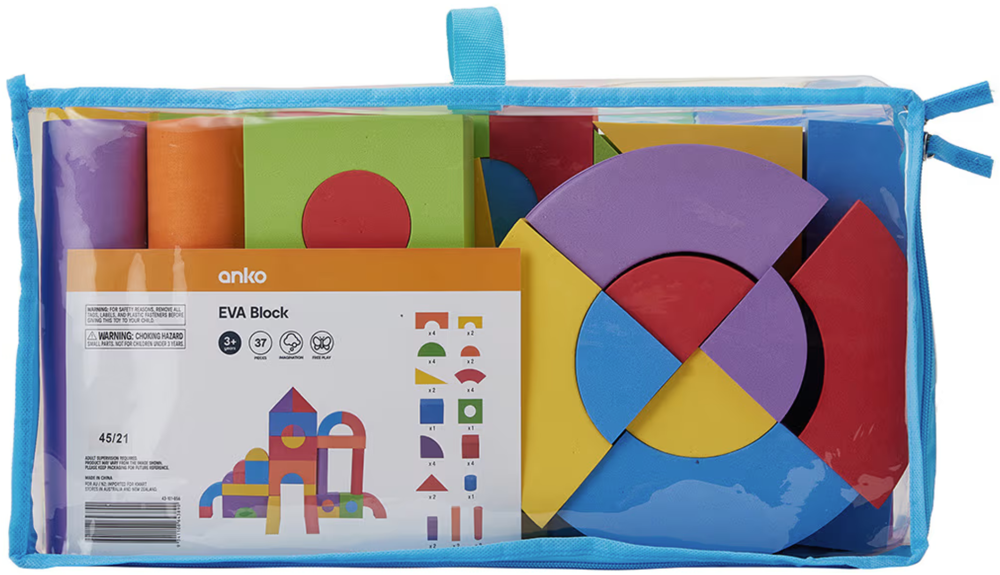
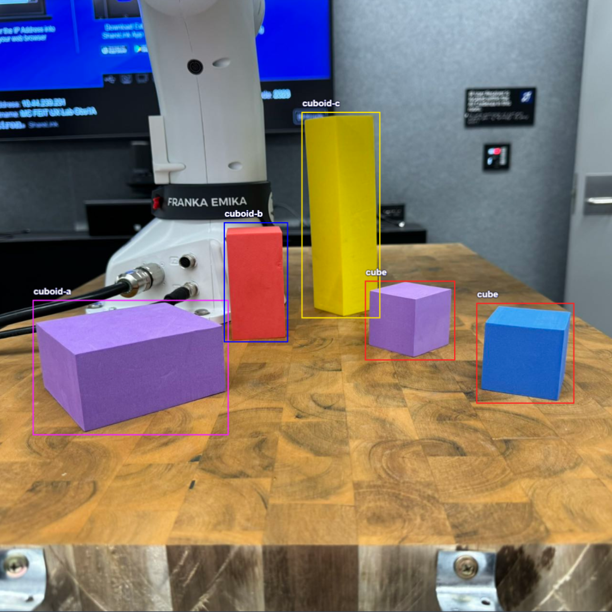

# Real-time XR Object Detection

## **Casting Meta Quest 3 View**

- Developer Hub - Beta Cast 2.0
- Add the casting window to [OBS](https://obsproject.com/) sources
- Stream settings
  - Server: `rtmp://127.0.0.1`
  - Set an arbitrary **Stream Key**
- Use [MonaServer](https://www.monaserver.ovh/) for local RTMP streaming
  - `rtmp://127.0.0.1//<Stream Key>`
- Output Settings
  - Video Bitrate: 1800 Kbps
  - Audio Bitrate: 64
  - Encoder Preset: Fastest
- Video Settings
  - Resolution: 1280 &times; 1280
  - FPS: 30

## [YOLOv8](https://docs.ultralytics.com/)

### [**GitHub**](https://github.com/ultralytics/ultralytics)

### Resources

- YouTube
  - [Ultralytics YOLOv8](https://www.youtube.com/playlist?list=PL1FZnkj4ad1PFJTjW4mWpHZhzgJinkNV0)
  - [YOLOv8 Tutorial](https://www.youtube.com/playlist?list=PLZCA39VpuaZZ1cjH4vEIdXIb0dCpZs3Y5)
- Colab
  - [YOLOv8 Tutorial](https://colab.research.google.com/github/ultralytics/ultralytics/blob/main/examples/tutorial.ipynb#scrollTo=ZY2VXXXu74w5)
  - [How to Train YOLOv8 Object Detection on a Custom Dataset](https://colab.research.google.com/github/roboflow-ai/notebooks/blob/main/notebooks/train-yolov8-object-detection-on-custom-dataset.ipynb)
- [YOLOv8 Models](https://docs.ultralytics.com/models/yolov8/#overview)

### Installation

* Install [Anaconda](https://www.anaconda.com/download)
* `conda create --name yolov8 python=3.8`
* `conda activate yolov8`
* Install in a **CUDA** environment
  * `conda install -c pytorch -c nvidia -c conda-forge pytorch torchvision pytorch-cuda=11.8 ultralytics`
  * If stuck at solving environment, try `conda config --set channel_priority strict`

## [Dataset](datasets_zip)

### Preparation

- Shot with iPhone
- Compressed to 1280 &times; 1280

- Annotation
  - [roboflow](https://app.roboflow.com/)
  - Secondary check

### EVA Block

#### Cubic100: 100 images of cubes and cuboids

#### Classes

| Preprocessing                                       | Augmentation                                                 | Train | Valid | Split |
| --------------------------------------------------- | ------------------------------------------------------------ | ----- | ----- | ----- |
| Auto-Orient Resize: Stretch to 640 &times; 640 | Flip: Horizontal Rotation: Between -15&deg; and +15&deg; | 209   | 20    | 10    |

### [Train Custom Models](models/custom)

| Model   | dataset  | epochs | Size | results                                         |
| ------- | -------- | ------ | ---- | ----------------------------------------------- |
| yolov8n | Cubic100 | 100    | 640  | [cubic100-v8n](models/runs/detect/cubic100-v8n) |
| yolov8s | Cubic100 | 100    | 640  | [cubic100-v8s](models/runs/detect/cubic100-v8s) |

### Performance

##### Device: NVIDIA GeForce RTX 4080 Laptop GPU

| Model                                                        | size (pixels) | mAPval 50-95 | preprocess (ms) | inference (ms) | postprocess (ms) | params(M) | FLOPs (B) |
| ------------------------------------------------------------ | ------------------ | ---------------------------- | -------------------- | ------------------- | --------------------- | --------- | -------------- |
| [cubic100-v8n](https://www.youtube.com/watch?v=XrV9wmnmguc&list=PLGZ6M30GmbVM7x_OCORl0q7Z4LuDY4KiY&index=1) | 640                | 0.927                        | 0.1                  | 0.9                 | 0.6                   | 3.2       | 8.7            |
| [cubic100-v8s](https://www.youtube.com/watch?v=stGOMXj_bpk&list=PLGZ6M30GmbVM7x_OCORl0q7Z4LuDY4KiY&index=2) | 640                | 0.937                        | 0.2                  | 1.9                 | 0.6                   | 11.2      | 28.6           |

